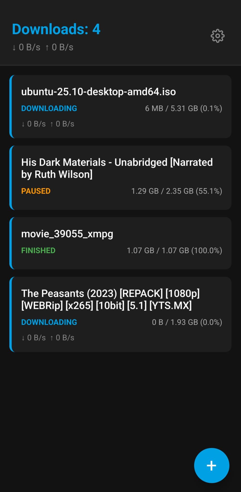

# Better DS Get

A modern, fast, and stable mobile client for Synology's Download Station, built with React Native and Expo.



[View Changelog](./CHANGELOG.md)

## Why "Better"?

Original Synology "DS Get" app suffered from several issues:
- **Connectivity**: Frequent logouts and session timeouts.
- **Search**: For search prompts that were too broad, the app would just log you out, breaking the search flow.

## Features

- **Connect to your Synology NAS**: Supports generic DSM connections to local network using HTTPS and HTTP, and **QuickConnect IDs**.
- **Integrated BT Search**: Search directly from the app using all search engines configured on your NAS. Results are persistent and update in the background.
- **Manage Download Tasks**: View, pause, resume, and delete tasks with **real-time progress updates** (5s auto-refresh on detail screen).
- **Add New Tasks**: 
  - One-tap addition from search results.
  - Submit Magnet links / URLs.
  - Upload `.torrent` files directly from your phone.
  - **Dynamic Destination Selection**: Choose specific download folders and use **Recent Folders** for 1-tap quick access.
  - **Selective Download**: Choose individual files *before* adding a torrent to the queue.
- **View Task Details**: Browse files inside BitTorrent tasks, check transfer speeds, **Time Left (ETA)**, and set file priorities (skip/unskip files).
- **Advanced Tracker Info**: Expose tracker geolocation flags, protocol security badges (UDP/HTTPS/HTTP), and performance metrics.
- **Technical Transparency**: Use the "Connection Info" overlay to see resolved IPs, protocol security, API counts, and session status.
- **Smart Persistence**: Remembers your URL, account, and **password** for instant re-logging. Supports "Soft Logout" to switch accounts without wiping settings.
- **Stable Background Session**: Periodic NAS pings keep your session alive for as long as you need.

## Getting Started

### Prerequisites
- Node.js LTS
- Yarn or npm
- Expo Go app on your device (or an emulator)

### Installation

1. Clone the repository:
   ```bash
   git clone https://github.com/antimirov/better_ds_get.git
   cd better_ds_get
   ```

2. Install dependencies:
   ```bash
   npm install
   ```

3. Start the Expo development server:
   ```bash
   npx expo start
   ```

4. Scan the QR code with your camera (iOS) or the Expo Go app (Android) to load the app on your device.

## Roadmap

- [x] Implement torrent searching using configured engines.
- [x] Support for QuickConnect and HTTPS.
- [x] Individual file priority management.
- [x] **v1.1.0 Release** (Search, QuickConnect, Password Persistence).
- [x] Support for selecting destination directory before adding a new torrent
- [x] Add progress bar to each download item in the main window. 
- [x] Add country flags to peers and trackers based on IP geolocation
- [x] Implement Android hardware back button support for all modals.
- [x] v1.2.0 Release (Trackers, Android UX, Layout Optimization, **Selective Download**, **Real-time Stats**).
- [x] Add Intent Filter for magnet links and .torrent files.
- [ ] Build a standalone `.apk` file for official release.
- [ ] Add a checkbox "Remember me" to the login screen. If checked, the app will remember the login credentials and will not ask for them again.

## License

This project is open-source. Please see the LICENSE file for details.
